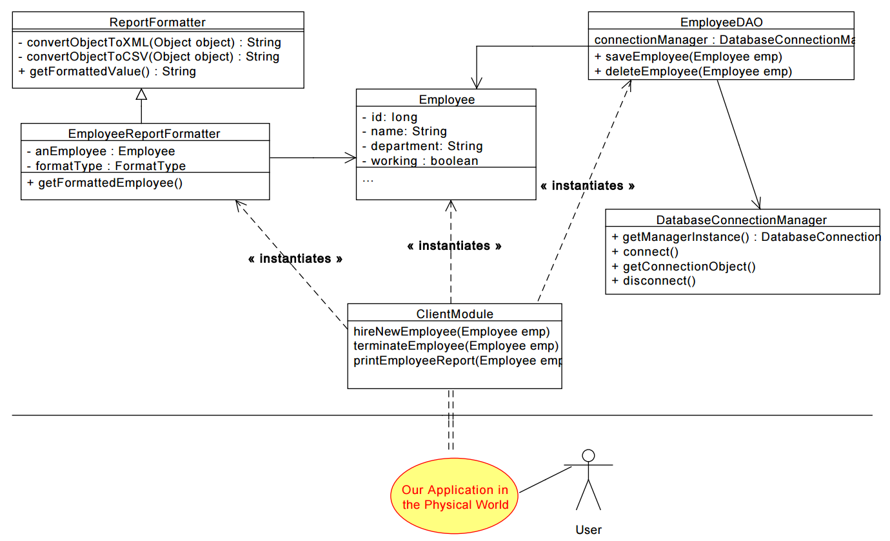

Here's the brief problem statement:  
Hospital Employee Management System  
- Hiring and Terminating employees
- Print reports in XML or CSV

Single Responsibility Principle:  
A class should have a single reason to change. It should only know about one thing.


Here's a bad design:
```java
class Employee {
    boolean working;
    long id;
    String department;
    String name;

    public void saveEmployeeToDatabase(){}
    public void printEmployeeDetailReportXML(){}
    public void printEmployeeDetailReportCSV(){}
    public void terminateEmployee(){}
}
```
because the class knows too much, really...
It will need to change when the database changes,
    and when the report format changes, and also when
    employee properties or behavior change.


The refined, SRP-adhering design is as found in 
